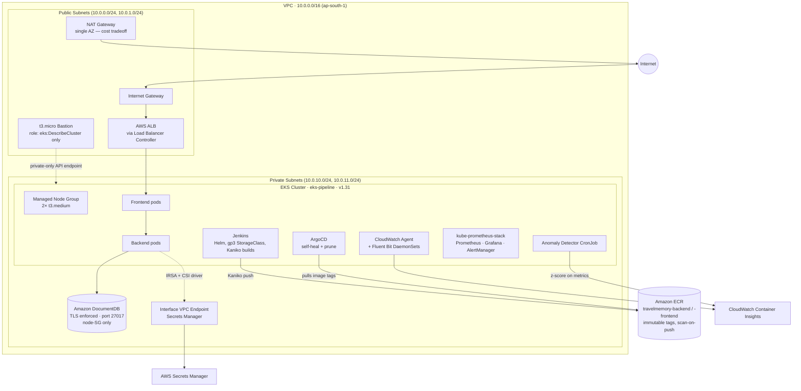

# ☸️ TravelMemory — EKS DevSecOps Pipeline (GitOps / Infrastructure Repo)

[](#)
[](#)
[](#)
[](#)
[](#)
[](#)
[](#)

> **This is the source of truth ArgoCD watches.** Every piece of infrastructure and every
> Kubernetes manifest for the TravelMemory pipeline lives here — Terraform, Ansible, Helm charts,
> raw K8s YAML, and the ArgoCD `Application` object itself. Application source code lives in the
> companion repo: **[travelmemory-eks-devsecops](https://github.com/HarjotSingh2k19/travelmemory-eks-devsecops)**.
>
> This README is written so **anyone can follow along end-to-end** — every command below is a real
> command that was actually run to build this pipeline, in the order it was run.

---

## 🎯 Why a separate repo for this?

ArgoCD's job is to reconcile whatever it's pointed at. Pointing it at a repo that *also* contains
application source code means every commit to app logic is a potential (accidental) trigger for a
cluster reconciliation, and it blurs the security boundary between "code that runs in a container"
and "code that has access to cluster state." Splitting them means:

- ArgoCD's `Application` (`argocd-app.yaml`, at this repo's root) only ever watches
  `devops/helm/travelmemory`, self-heals, and prunes — with zero visibility into app source.
- Jenkins (running in the *app* repo's CI) only ever **writes** to this repo — bumping an image
  tag in `values.yaml` — never the reverse.
- Terraform state, Helm charts, and raw manifests can be reviewed, audited, and rolled back
  independently of application releases.

---

## ✅ Prerequisites

Install and verify these **before running any command below**:

| Tool | Version used | Verify with |
|---|---|---|
| AWS CLI | v2.x | `aws --version` |
| Terraform | v1.14.x (any 1.x is fine) | `terraform -version` |
| kubectl | v1.31.x (match your cluster's minor version) | `kubectl version --client` |
| Helm | v3.x | `helm version` |
| Ansible | v2.15+ | `ansible --version` |
| Docker (with `buildx`) | v24+ | `docker buildx version` |
| An SSH client | any | `ssh -V` |

**AWS account setup:**

```bash
aws configure                # ensure credentials exist
aws sts get-caller-identity  # confirm you're using the right account + IAM user
```

The IAM user/role you configure needs permissions to create: VPCs/subnets/NAT/IGW, EKS clusters
and node groups, EC2 instances, DocumentDB clusters, ECR repositories, IAM roles/policies
(including OIDC providers for IRSA), Secrets Manager secrets, S3 buckets, and VPC interface
endpoints. For a personal/portfolio build, attaching `AdministratorAccess` to a dedicated IAM user
is the simplest path — just don't reuse that user's long-lived keys anywhere else.

Throughout this guide, replace these placeholders with your own values:

| Placeholder | What it is |
|---|---|
| `<YOUR_AWS_ACCOUNT_ID>` | Your 12-digit AWS account ID (`aws sts get-caller-identity --query Account`) |
| `<BASTION_PUBLIC_IP>` | The bastion EC2's current public IP — changes on every stop/start |
| `<BASTION_INSTANCE_ID>` | The bastion EC2's instance ID (`i-xxxxxxxxxxxxxxxxx`) |
| `<NODEGROUP_NAME>` | Your EKS managed node group's name (`aws eks list-nodegroups`) |
| `<YOUR_HOME_IP>` | Your current public IP (`curl -4 ifconfig.me`), used to restrict bastion SSH |

---

## 🏗️ Architecture



### Design decisions worth defending in an interview

| Decision | Reasoning |
|---|---|
| Single NAT Gateway | Deliberate cost tradeoff — not HA, acceptable for a demo/portfolio pipeline |
| Bastion + NAT in the same public subnet | Same cost reasoning; simplifies the public route table |
| EKS API endpoint switched to **private-only** after bring-up | Forces all cluster access through the bastion; laptop access verified blocked, bastion access verified working |
| DocumentDB in private subnet only, SG scoped to EKS nodes | No network path to the database except through the cluster |
| ECR immutable tags + scan-on-push | Prevents tag overwrites; catches known CVEs before Jenkins triage even runs |
| Secrets via IRSA + Secrets Manager CSI (not K8s Secrets in Git) | DB credentials never touch the GitOps repo or Helm values |

---

## 📁 Repository structure (verified against `main` on GitHub)

```text
travelmemory-eks-devsecops-gitops/
├── .gitignore
├── argocd-app.yaml              ← ArgoCD Application (root of this repo)
└── devops/
    ├── terraform/                ← ALL infrastructure-as-code
    │   ├── network.tf            ← VPC, subnets, IGW, NAT
    │   ├── eks.tf                ← EKS cluster + managed node group
    │   ├── ecr.tf                ← ECR repos (immutable, scan-on-push)
    │   ├── documentdb.tf         ← DocumentDB cluster
    │   ├── bastion.tf            ← EC2 + IAM instance role
    │   ├── vpc_endpoints.tf      ← Secrets Manager interface endpoint
    │   ├── backend-irsa.tf       ← IRSA role for backend pods
    │   ├── jenkins-irsa.tf       ← IRSA role for jenkins-agent-sa (ECR push/pull)
    │   ├── alb-controller.tf     ← IRSA role for ALB controller
    │   ├── ebs-csi.tf            ← EBS CSI driver addon (Jenkins PV)
    │   ├── anomaly-detector-irsa.tf ← IRSA role, CloudWatch read-only
    │   ├── provider.tf / terraform.tf / variables.tf / outputs.tf
    │   └── .terraform.lock.hcl
    ├── ansible/
    │   ├── ansible.cfg
    │   ├── bastion-setup.yml     ← installs AWS CLI v2, kubectl v1.31, Helm
    │   ├── inventory.ini
    │   └── inventory.ini.example
    ├── helm/travelmemory/
    │   ├── Chart.yaml
    │   ├── values.yaml            ← image tags updated by CI (the GitOps trigger)
    │   └── templates/
    │       ├── backend-deployment.yaml
    │       ├── backend-service.yaml
    │       ├── frontend-deployment.yaml
    │       ├── frontend-service.yaml
    │       └── ingress.yaml       ← ALB ingress
    └── k8s/                       ← raw manifests, not templated via Helm
        ├── anomaly-detector-cronjob.yaml
        ├── backend-sa.yaml
        ├── docdb-ca-cert.yaml     ← ConfigMap: global-bundle.pem
        ├── docdb-secret-provider.yaml ← SecretProviderClass (ASCP, jmesPath)
        ├── gp3-storageclass.yaml  ← default StorageClass, required by Jenkins PV
        └── jenkins-agent-sa.yaml
```

---

## 🧭 Full Walkthrough — every command, in order

### Prerequisites

```bash
aws configure                # ensure credentials exist
aws sts get-caller-identity  # confirm account <YOUR_AWS_ACCOUNT_ID> / user terraform-admin
terraform -version           # 1.14.7 used; newer is fine

# Create key pair for bastion SSH (ap-south-1, once only)
aws ec2 create-key-pair --key-name eks-pipeline-key --region ap-south-1 \
  --query 'KeyMaterial' --output text > ~/.ssh/eks-pipeline-key.pem
chmod 400 ~/.ssh/eks-pipeline-key.pem
```

> ⚠️ **EKS only supports specific Kubernetes minor versions for NEW clusters** — versions get
> deprecated over time. This pipeline used `cluster_version = "1.31"`; verify the current
> supported list before rebuilding, or you'll hit `InvalidParameterException` on apply.

### Step 1 — Terraform: the entire AWS foundation

```bash
cd travelmemory-eks-devsecops-gitops/devops/terraform
touch network.tf eks.tf ecr.tf documentdb.tf bastion.tf \
      vpc_endpoints.tf variables.tf outputs.tf provider.tf terraform.tf
```

One-time S3 remote-state bootstrap (not managed by Terraform itself):

```bash
aws s3api create-bucket \
  --bucket harjotsingh2k19-eks-pipeline-tfstate \
  --region ap-south-1 \
  --create-bucket-configuration LocationConstraint=ap-south-1

aws s3api put-bucket-versioning \
  --bucket harjotsingh2k19-eks-pipeline-tfstate \
  --versioning-configuration Status=Enabled

aws s3api put-bucket-encryption \
  --bucket harjotsingh2k19-eks-pipeline-tfstate \
  --server-side-encryption-configuration '{"Rules":[{"ApplyServerSideEncryptionByDefault":{"SSEAlgorithm":"AES256"}}]}'
```

Init, plan, apply:

```bash
terraform init
terraform fmt && terraform validate
terraform plan -out=tfplan     # review carefully
terraform apply tfplan         # ~15-20 min, dominated by EKS control plane
```

**✅ Expected output** (tail of `terraform apply`):

```text
module.eks.aws_eks_cluster.this[0]: Creation complete after 11m23s [id=eks-pipeline]
module.eks.module.eks_managed_node_group["default"].aws_eks_node_group.this[0]: Creation complete after 3m41s
aws_docdb_cluster.this: Creation complete after 6m52s [id=eks-pipeline-docdb]

Apply complete! Resources: 61 added, 0 changed, 0 destroyed.

Outputs:

bastion_public_ip = "<BASTION_PUBLIC_IP>"
cluster_endpoint  = "https://XXXXXXXXXXXXXXXXXXXXXXXXXXXXXXXX.gr7.ap-south-1.eks.amazonaws.com"
```

> 💡 Subnets are tagged `kubernetes.io/role/elb` / `kubernetes.io/role/internal-elb` — the AWS
> Load Balancer Controller auto-discovers subnets via exactly these tags. Missing them silently
> breaks the ALB step later.
>
> ⚠️ Two things always change between sessions: **(1)** your home IP —
> `curl -4 ifconfig.me` (not plain `curl` — IPv6 breaks the CIDR), compare to `my_home_ip` in
> `terraform.tfvars`; **(2)** the bastion's public IP changes on every stop/start.

Grant `kubectl` access (the `terraform-aws-modules/eks` module defaults
`bootstrap_cluster_creator_admin_permissions = false`):

```bash
aws eks update-kubeconfig --region ap-south-1 --name eks-pipeline

aws eks create-access-entry --cluster-name eks-pipeline --region ap-south-1 \
  --principal-arn arn:aws:iam::<YOUR_AWS_ACCOUNT_ID>:user/terraform-admin --type STANDARD

aws eks associate-access-policy --cluster-name eks-pipeline --region ap-south-1 \
  --principal-arn arn:aws:iam::<YOUR_AWS_ACCOUNT_ID>:user/terraform-admin \
  --policy-arn arn:aws:eks::aws:cluster-access-policy/AmazonEKSClusterAdminPolicy \
  --access-scope type=cluster

kubectl get nodes   # expect 2 Ready nodes
```

**✅ Expected output:**

```text
NAME                                            STATUS   ROLES    AGE   VERSION
ip-10-0-10-142.ap-south-1.compute.internal      Ready    <none>   4m    v1.31.x-eks-xxxxxxx
ip-10-0-11-87.ap-south-1.compute.internal       Ready    <none>   4m    v1.31.x-eks-xxxxxxx
```

### Step 2 — Ansible: provision the bastion, then lock the cluster down

```bash
cd ../ansible
ansible bastion -m ping                # verify connectivity first
ansible-playbook bastion-setup.yml     # expect failed=0 on a clean run
```

**✅ Expected output** (final play recap):

```text
PLAY RECAP *********************************************************
bastion-host : ok=8    changed=6    unreachable=0    failed=0    skipped=1
```

`bastion-setup.yml` installs AWS CLI v2, `kubectl` (matching the cluster's minor version), and
Helm — idempotently.

Once the bastion can reach the cluster, flip the API endpoint to private-only and verify the
split:

```hcl
# eks.tf
cluster_endpoint_public_access  = false
cluster_endpoint_private_access = true
```

```bash
terraform apply

# From your laptop — should hang/timeout (this is success):
kubectl get nodes

# From the bastion — should still work:
aws sts get-caller-identity   # must show assumed-role/eks-pipeline-bastion-role
kubectl get nodes             # 2 Ready nodes
```

**✅ Expected output — laptop:**

```text
Unable to connect to the server: dial tcp <private-ip>:443: i/o timeout
```

**✅ Expected output — bastion:**

```text
{
    "Arn": "arn:aws:sts::<YOUR_AWS_ACCOUNT_ID>:assumed-role/eks-pipeline-bastion-role/i-xxxxxxxx"
}
NAME                                            STATUS   ROLES    AGE   VERSION
ip-10-0-10-142.ap-south-1.compute.internal      Ready    <none>   9m    v1.31.x-eks-xxxxxxx
ip-10-0-11-87.ap-south-1.compute.internal       Ready    <none>   9m    v1.31.x-eks-xxxxxxx
```

> ⚠️ Without the security group rule opening port 443 from the bastion's SG to the cluster SG,
> `kubectl` from the bastion fails with `dial tcp <ip>:443: i/o timeout` — not `401`. The error
> type tells you which trust layer is broken: **timeout = network**, **401 = RBAC**,
> **AccessDenied = IAM**.

### Step 3 — DocumentDB CA cert + bare Deployment (prove connectivity first)

```bash
# On the bastion:
curl -o global-bundle.pem https://truststore.pki.rds.amazonaws.com/global/global-bundle.pem
kubectl create configmap docdb-ca-cert --from-file=global-bundle.pem=./global-bundle.pem
```

Verify from inside a pod (use `127.0.0.1`, not `localhost` — Alpine's musl libc can fail to
resolve it):

```bash
kubectl exec -it <backend-pod> -- sh
/app # wget -qO- http://127.0.0.1:3000/trip/
[]   # empty array = backend connected to DocumentDB successfully
```

### Step 4 — Secrets Manager + IRSA (remove the plaintext creds)

```bash
aws secretsmanager create-secret \
  --name travelmemory/docdb-mongo-uri \
  --region ap-south-1 \
  --secret-string '{"MONGO_URI":"mongodb://tmadmin:<pass>@<endpoint>:27017/travelmemory?tls=true&..."}'
```

Install the Secrets Store CSI Driver + AWS provider on the bastion:

```bash
helm repo add secrets-store-csi-driver \
  https://kubernetes-sigs.github.io/secrets-store-csi-driver/charts
helm install csi-secrets-store secrets-store-csi-driver/secrets-store-csi-driver \
  --namespace kube-system --set syncSecret.enabled=true

kubectl apply -f https://raw.githubusercontent.com/aws/secrets-store-csi-driver-provider-aws/main/deployment/aws-provider-installer.yaml

# Real bug hit & fixed: tokenRequests was missing from the CSIDriver object
kubectl patch csidriver secrets-store.csi.k8s.io --type='json' \
  -p='[{"op":"add","path":"/spec/tokenRequests","value":[{"audience":"sts.amazonaws.com","expirationSeconds":3600}]}]'
```

> ⚠️ Without that patch, pods with the CSI volume mount get stuck in `ContainerCreating` with
> `CSI token error: serviceAccount.tokens not provided`.

Apply the ServiceAccount + SecretProviderClass (`devops/k8s/backend-sa.yaml`,
`devops/k8s/docdb-secret-provider.yaml`), then verify the full chain:

```bash
kubectl get secret docdb-mongo-uri-k8s   # must exist — proof the CSI chain worked
kubectl exec -it <backend-pod> -- sh
/app # wget -qO- http://127.0.0.1:3000/trip/
[]   # proof: app reads MONGO_URI from the synced secret
```

### Step 5 — Jenkins on Kubernetes

Requires the EBS CSI driver (via `ebs-csi.tf`) and a default `gp3` StorageClass
(`devops/k8s/gp3-storageclass.yaml`) — EKS ships neither by default.

```bash
kubectl apply -f devops/k8s/gp3-storageclass.yaml

helm repo add jenkins https://charts.jenkins.io && helm repo update
helm install jenkins jenkins/jenkins -n jenkins --create-namespace \
  --set controller.serviceType=ClusterIP \
  --set persistence.size=8Gi
```

**✅ Expected output:**

```text
NAME: jenkins
STATUS: deployed
NOTES:
1. Get your 'admin' user password by running:
  kubectl exec --namespace jenkins -it svc/jenkins -c jenkins -- /bin/cat /run/secrets/additional/chart-admin-password
```

```bash
kubectl get pods -n jenkins   # expect: jenkins-0   2/2   Running
```

> ⚠️ If the StorageClass is missing, Jenkins pods stay `Pending` forever with
> `pod has unbound immediate PersistentVolumeClaims`. Check `kubectl get pvc -n jenkins` first.

IRSA for Jenkins build agents (ECR push/pull only, used by Kaniko — no Docker-in-Docker, no
`privileged: true`):

```bash
kubectl create serviceaccount jenkins-agent-sa -n jenkins
kubectl annotate serviceaccount jenkins-agent-sa -n jenkins \
  eks.amazonaws.com/role-arn=arn:aws:iam::<YOUR_AWS_ACCOUNT_ID>:role/eks-pipeline-jenkins-irsa
```

### Step 6 — ArgoCD

```bash
kubectl create namespace argocd
kubectl apply -n argocd -f \
  https://raw.githubusercontent.com/argoproj/argo-cd/stable/manifests/install.yaml

# Get the initial admin password:
kubectl -n argocd get secret argocd-initial-admin-secret \
  -o jsonpath="{.data.password}" | base64 -d
```

Then apply `argocd-app.yaml` (this repo's root) — it points ArgoCD at
`devops/helm/travelmemory` with `selfHeal: true` and `prune: true`:

```bash
kubectl apply -n argocd -f argocd-app.yaml
```

**✅ Expected output:**

```bash
kubectl get application -n argocd
```
```text
NAME                       SYNC STATUS   HEALTH STATUS
travelmemory-gitops-app    Synced        Healthy
```

> 💡 `path: devops/helm/travelmemory` must exactly match where `Chart.yaml` actually lives. Get
> it wrong and ArgoCD silently shows `Synced` while deploying nothing.

### Step 7 — AWS Load Balancer Controller (real public ALB)

```bash
helm repo add eks https://aws.github.io/eks-charts && helm repo update
helm install aws-load-balancer-controller eks/aws-load-balancer-controller \
  -n kube-system \
  --set clusterName=eks-pipeline \
  --set serviceAccount.create=false \
  --set serviceAccount.name=aws-load-balancer-controller
```

The Ingress template lives at `devops/helm/travelmemory/templates/ingress.yaml` and is deployed by
ArgoCD along with everything else.

**✅ Expected output:**

```bash
kubectl get ingress -n default
```
```text
NAME                   CLASS   HOSTS   ADDRESS                                                    PORTS   AGE
travelmemory-ingress   alb     *       k8s-default-travelme-xxxxxxxxxx-xxxxxxxxxx.ap-south-1.elb.amazonaws.com   80      2m
```

Open the `ADDRESS` value in a browser — that's a real, public AWS ALB DNS name, provisioned
entirely from the Kubernetes `Ingress` object above. (Verified public URL from this build:
`k8s-default-travelme-c6fa32db6e-25682244.ap-south-1.elb.amazonaws.com`.)

### Step 8 — Observability: CloudWatch + Prometheus/Grafana, side by side

```bash
# CloudWatch Container Insights (EKS-managed add-on):
aws eks create-addon \
  --cluster-name eks-pipeline \
  --addon-name amazon-cloudwatch-observability \
  --region ap-south-1

kubectl get pods -n amazon-cloudwatch   # cloudwatch-agent + fluent-bit, per node

# Prometheus + Grafana:
helm repo add prometheus-community \
  https://prometheus-community.github.io/helm-charts
helm install prometheus prometheus-community/kube-prometheus-stack \
  --namespace monitoring --create-namespace

kubectl get pods -n monitoring   # alertmanager, grafana, operator, kube-state-metrics, node-exporters
```

**✅ Expected output:**

```text
NAME                                                    READY   STATUS    RESTARTS
alertmanager-prometheus-kube-prometheus-alertmanager-0  2/2     Running   0
prometheus-grafana-xxxxxxxxxx-xxxxx                     3/3     Running   0
prometheus-kube-prometheus-operator-xxxxxxxxxx-xxxxx     1/1     Running   0
prometheus-kube-state-metrics-xxxxxxxxxx-xxxxx           1/1     Running   0
prometheus-prometheus-node-exporter-xxxxx                1/1     Running   0
prometheus-prometheus-kube-prometheus-prometheus-0       2/2     Running   0
```

### Step 9 — AI #2: anomaly detection CronJob

The `anomaly-detector.py` script is **maintained and version-controlled in the app repo**
(`scripts/anomaly-detector.py`), alongside the rest of the application code it monitors. It is
**deployed via a Kubernetes ConfigMap**, defined in this repo at
`devops/helm/travelmemory/templates/` alongside its ServiceAccount and CronJob manifest — Helm
renders the script's contents into that ConfigMap at deploy time, and ArgoCD keeps it in sync. The
CronJob runs every 15 minutes, pulling 7 days of hourly CloudWatch metrics and flagging anything
more than 3 standard deviations from baseline.

> 💡 This is a deliberate two-repo tradeoff, not an oversight: the script's *source* lives with the
> application for code review and version history, while its *runtime artifact* (the ConfigMap)
> lives with the infrastructure it's deployed alongside. The current pipeline updates this
> ConfigMap manually when the script changes — a natural next iteration would be a small Jenkins
> stage that syncs `scripts/anomaly-detector.py` into the ConfigMap automatically, the same way
> Stage 8 already syncs image tags.

---

## 🖥️ Accessing the services (SSH tunnel + `kubectl port-forward`)

The EKS API endpoint is **private-only**, so every in-cluster UI is reached the same way: an SSH
tunnel to the bastion, then a `kubectl port-forward` run *from inside that SSH session*, then open
the forwarded port in your local browser.

> Replace `<BASTION_PUBLIC_IP>` with the bastion's **current** public IP — it changes on every
> stop/start (`aws ec2 describe-instances --instance-ids <id> --query 'Reservations[0].Instances[0].PublicIpAddress'`).

**Jenkins**

```bash
# Terminal 1 — SSH tunnel from your machine through the bastion:
ssh -i ~/.ssh/eks-pipeline-key.pem -L 8080:localhost:8080 ubuntu@<BASTION_PUBLIC_IP>

# Terminal 2 (inside that SSH session) — port-forward into the cluster:
kubectl --namespace jenkins port-forward svc/jenkins 8080:8080

# Get the admin password:
kubectl exec --namespace jenkins -it svc/jenkins -c jenkins -- \
  /bin/cat /run/secrets/additional/chart-admin-password && echo

# Open http://localhost:8080
```

**ArgoCD**

```bash
ssh -i ~/.ssh/eks-pipeline-key.pem -L 8888:localhost:8888 ubuntu@<BASTION_PUBLIC_IP>
kubectl --namespace argocd port-forward svc/argocd-server 8888:443
```

Open `https://localhost:8888` and log in with:

- **Username:** `admin`
- **Password:** the output of the `kubectl -n argocd get secret argocd-initial-admin-secret ...` command from Step 6 above — it's a fresh, randomly-generated secret on every install. Never commit this value to Git; change it and delete the `argocd-initial-admin-secret` object as soon as you've logged in once.

**Grafana**

```bash
ssh -i ~/.ssh/eks-pipeline-key.pem -L 3000:localhost:3000 ubuntu@<BASTION_PUBLIC_IP>
kubectl port-forward svc/prometheus-grafana 3000:80 -n monitoring
```

Open `http://localhost:3000` and log in with:

- **Username:** `admin`
- **Password:** `admin` *(kube-prometheus-stack default — change it on first login)*

**Prometheus**

```bash
ssh -i ~/.ssh/eks-pipeline-key.pem -L 9090:localhost:9090 ubuntu@<BASTION_PUBLIC_IP>
kubectl port-forward svc/prometheus-kube-prometheus-prometheus 9090:9090 -n monitoring
```

Open `http://localhost:9090`.

> All four follow the identical two-hop pattern: **SSH tunnel to the bastion** (because the API
> server has no public endpoint) → **`kubectl port-forward`** to the actual in-cluster Service.
> Only the local/remote port numbers and the `-n <namespace>` change.

---

## 🔁 The zero-touch loop, proven end-to-end

```text
git push to app repo
  → Jenkins webhook fires, ephemeral Kaniko pod agent spins up
  → Stage 1: checkout
  → Stage 2: npm test passes
  → Stage 3: gitleaks scan
  → Stage 4: Checkov IaC scan (report-only)
  → Stage 5: Kaniko builds both images, pushes :12 to ECR
  → Stage 6: Trivy scans both images
  → Stage 7: Gemini AI triage returns PASS
  → Stage 8: sed updates values.yaml tag: '12', commits "[skip ci]", pushes to THIS repo
  → ArgoCD detects the diff in values.yaml, syncs, rolling update
  → kubectl describe deployment backend | grep Image  →  confirms :12 running
```

> ⚠️ `selfHeal: true` does **not** protect against a bad image committed to Git — it only reverts
> manual `kubectl` drift back to what Git says. If Git points at a broken tag, `selfHeal`
> faithfully keeps that broken state running. Recovery always happens in Git
> (`git revert` or `argocd app rollback`), never against the live cluster.
>
> `argocd-applicationset-controller` runs in `CrashLoopBackOff` due to a missing CRD from the
> install — harmless, since ApplicationSets aren't used here.

---

## 🧯 Rollback & failure modes (all actually simulated)

| Scenario | How it was diagnosed | Fix |
|---|---|---|
| Bad image deploy | `kubectl get pods` → `CrashLoopBackOff`; `kubectl logs <pod> --previous` | `argocd app rollback <app> <rev>` **or** `git revert` in this repo |
| Stuck rollout | `kubectl rollout status deployment/backend` hangs; `kubectl describe pod` Events | `kubectl rollout undo deployment/backend` (emergency), then fix in Git |
| IRSA broken | App boots, then `AccessDenied` on `GetSecretValue` in logs (not a Mongo error) | Check `eks.amazonaws.com/role-arn` annotation and the OIDC `sub` condition string |
| DocumentDB connectivity lost (**actually observed**) | `kubectl get pods` → 5 restarts, `Exit Code: 1`, matching when DocDB was stopped | `conn.js` connects unconditionally at import; needs Mongoose retry/backoff (documented gap, not silently ignored) |
| Jenkins pipeline gate failure | Any stage exits non-zero → pipeline stops immediately | By design — no broken image reaches ECR, no bad tag reaches this repo |

---

## 💰 Cost optimisation — what's pausable vs what always bills

| Resource | Pausable? | Command |
|---|---|---|
| EKS control plane (~$0.10/hr) | ❌ No | Only `terraform destroy` stops this |
| NAT Gateway (~$0.045/hr) | ❌ No | Delete/recreate is tedious — accepted as idle cost |
| VPC Interface Endpoint (~$0.01/hr) | ❌ No | Trivial, not worth managing |
| EC2 worker nodes (2× t3.medium) | ✅ Yes | `aws eks update-nodegroup-config --scaling-config desiredSize=0` |
| Bastion EC2 (t3.micro) | ✅ Yes | `aws ec2 stop-instances --instance-ids <id>` |
| DocumentDB (db.t3.medium) | ✅ Yes | `aws docdb stop-db-cluster --db-cluster-identifier eks-pipeline-docdb` |

**Start-of-session checklist:**

```bash
# 1. Resume paused resources (DocumentDB first — slowest to start)
aws docdb start-db-cluster --db-cluster-identifier eks-pipeline-docdb --region ap-south-1
aws ec2 start-instances --instance-ids <BASTION_INSTANCE_ID> --region ap-south-1
aws eks update-nodegroup-config --cluster-name eks-pipeline --region ap-south-1 \
  --nodegroup-name <nodegroup-name> \
  --scaling-config minSize=1,maxSize=3,desiredSize=2

# 2. Get the CURRENT bastion IP (changes every stop/start)
aws ec2 describe-instances --instance-ids <BASTION_INSTANCE_ID> --region ap-south-1 \
  --query 'Reservations[0].Instances[0].PublicIpAddress' --output text

# 3. Check YOUR current home IP (changes between ISP sessions)
curl -4 ifconfig.me   # NOT plain curl — IPv6 breaks the CIDR

# 4. If it changed, update terraform.tfvars and re-apply
terraform -chdir=devops/terraform apply

# 5. Verify everything is live
aws docdb describe-db-clusters --db-cluster-identifier eks-pipeline-docdb --query 'DBClusters[0].Status'
aws ec2 describe-instances --instance-ids <BASTION_INSTANCE_ID> --query '...State.Name'
aws eks describe-nodegroup --cluster-name eks-pipeline --nodegroup-name <ng> --query 'nodegroup.status'
```

Total AWS credits used for this build: **~$93** (of a small personal budget). Infrastructure was
fully destroyed and verified after proving the pipeline end-to-end.

---

## 🔥 Tear-Down — do this before you close the laptop

**An idle EKS cluster + NAT Gateway + DocumentDB bills every hour, whether you're using it or
not.** Don't skip this section. Tear down in this order — Terraform can get stuck if Kubernetes
still owns resources (like the ALB) that Terraform doesn't know about:

```bash
# 1. Delete the ArgoCD Application FIRST (with cascade) — otherwise ArgoCD's
#    selfHeal will fight Terraform, and the ALB Controller won't release its ALB
kubectl delete -n argocd -f argocd-app.yaml --cascade=foreground

# 2. Uninstall the AWS Load Balancer Controller's Helm release — this is what
#    actually de-provisions the ALB itself; skipping this step is the #1 cause
#    of "terraform destroy hangs on the VPC/subnets" support threads
helm uninstall aws-load-balancer-controller -n kube-system

# 3. Confirm the ALB is actually gone before proceeding
aws elbv2 describe-load-balancers --region ap-south-1 \
  --query "LoadBalancers[?contains(LoadBalancerName, 'k8s-default-travelme')]"
# expect: []

# 4. Uninstall the remaining Helm releases (Jenkins, ArgoCD, Prometheus stack, CSI driver)
helm uninstall jenkins -n jenkins
kubectl delete namespace argocd
helm uninstall prometheus -n monitoring
helm uninstall csi-secrets-store -n kube-system

# 5. NOW destroy the Terraform-managed infrastructure
cd devops/terraform
terraform plan -destroy -out=tfplan.destroy   # review what's about to be deleted
terraform apply tfplan.destroy                # ~10-15 min
```

**✅ Expected output** (tail of `terraform apply tfplan.destroy`):

```text
module.eks.aws_eks_cluster.this[0]: Destruction complete after 6m12s
aws_docdb_cluster.this: Destruction complete after 4m3s
aws_nat_gateway.this: Destruction complete after 42s
aws_vpc.this: Destruction complete after 3s

Destroy complete! Resources: 61 destroyed.
```

```bash
# 6. Verify nothing billable is left running
aws eks list-clusters --region ap-south-1                      # expect: []
aws ec2 describe-instances --region ap-south-1 \
  --filters "Name=instance-state-name,Values=running" \
  --query "Reservations[].Instances[].InstanceId"               # expect: []
aws docdb describe-db-clusters --region ap-south-1 \
  --query "DBClusters[].Status"                                 # expect: []
aws ec2 describe-nat-gateways --region ap-south-1 \
  --filter "Name=state,Values=available" \
  --query "NatGateways[].NatGatewayId"                          # expect: []
```

**What's safe to leave behind (near-zero cost):**

- The S3 Terraform state bucket (`harjotsingh2k19-eks-pipeline-tfstate` in this build) — state
  storage only, fractions of a cent/month.
- ECR repositories, *after* deleting the images inside them if you want zero storage cost:
  ```bash
  aws ecr batch-delete-image --repository-name travelmemory-backend --region ap-south-1 \
    --image-ids "$(aws ecr list-images --repository-name travelmemory-backend --region ap-south-1 --query 'imageIds' --output json)"
  aws ecr delete-repository --repository-name travelmemory-backend --region ap-south-1 --force
  aws ecr delete-repository --repository-name travelmemory-frontend --region ap-south-1 --force
  ```
- The Secrets Manager secret, if you plan to rebuild soon — otherwise:
  ```bash
  aws secretsmanager delete-secret --secret-id travelmemory/docdb-mongo-uri --region ap-south-1 \
    --force-delete-without-recovery
  ```

---

## 🔗 Related repos

- **Application repo:** [travelmemory-eks-devsecops](https://github.com/HarjotSingh2k19/travelmemory-eks-devsecops) — MERN app source, Dockerfiles, Jenkinsfile, AI scripts.
- **Sibling project:** GitOps Factory — a self-hosted Jenkins → ArgoCD → KIND-on-EC2 pipeline, showing the same GitOps philosophy without managed EKS.

## 📜 License

MIT.
